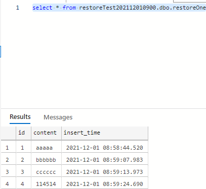

## 快照

数据库快照是 SQL Server 数据库（源数据库）的只读静态视图。自创建快照那刻起，数据库快照在事务上与源数据库一致。数据库快照始终与其源数据库位于同一服务器实例上。虽然数据库快照提供与创建快照时处于相同状态的数据的只读视图，但快照文件的大小随着对源数据库的更改而增大。给定源数据库中可以存在多个快照。在数据库所有者显式删除每个数据库快照之前，该快照将一直保留。

<!-- more -->

在SQL Server中，快照的存储形式为一个或多个“稀疏文件”。最初，稀疏文件实质上是空文件，不包含用户数据并且未被分配存储用户数据的磁盘空间。随着源数据库中更新的页越来越多，文件的大小也不断增长。定期创建数据库快照，可以减轻重大用户错误的影响。为了很好地保护数据，可以创建时间跨度足以识别和处理大多数用户错误的一系列数据库快照。例如，根据磁盘资源，可以每 24 小时创建 6 到 12 个滚动快照。每创建一个新的快照，就删除最早的快照。

> 以下实验均采用此数据表结构
> 
>	```sql
>	create table restoreOne (
>	  id INT not null identity(1,1) primary key,
>	  content VARCHAR(64) not null,
>	  insert_time DATETIME default GETDATE()
>	)
>	
>	create table some_contents(
>	  id INT,
>	  content VARCHAR(45)
>	)
>	```


所有的实验在`restore_test`数据库下完成，结构如下图所示：



插入一些初始数据后，表中数据如下所示：


<!-- tab <code>dbo.restoreOne</code> 数据表 -->
|   | id | content | insert\_time            |
| - | -- | ------- | ----------------------- |
| 1 | 1  | aaaaa   | 2021-12-01 08:58:44.520 |
| 2 | 2  | bbbbbb  | 2021-12-01 08:59:07.983 |
| 3 | 3  | cccccc  | 2021-12-01 08:59:13.973 |
| 4 | 4  | 114514  | 2021-12-01 08:59:24.690 |
<!-- endtab -->
<!-- tab <code>dbo.some_contents</code> 数据表 -->
|   | id | content |
| - | -- | ------- |
| 1 | 1  | aaa     |
| 2 | 2  | bbb     |
<!-- endtab -->



### 创建

在MSSQL中，使用Transact-SQL语句创建某数据库快照的方法是

```sql
CREATE DATABASE database_snapshot_name
ON
(
  NAME =logical_file_name,
  FILENAME ='os_file_name'
) [ ,...n ]
AS SNAPSHOT OF source_database_name
[;]
```

其中，`source_database_name` 是源数据库，`logical_file_name` 是引用该文件时在 SQL Server 中使用的逻辑名称，其与源数据库数据文件应该使用相同名称。



`os_file_name` 是创建该文件时操作系统使用的路径和文件名，`database_snapshot_name` 是将数据库恢复到的快照的名称。

对前述`restore_test`数据库创建九点钟的快照，使用如下语句：

```sql
create database restoreTest202112010900 on
(
  name='restore_test',
  filename='f:\restoreTest.mdf'
)
as snapshot of restore_test
```


由T-SQL语句可得知，快照的本质也是数据库


会在数据库列表里看到一个新数据库：



磁盘上的实体文件如下所示：



### 查询

使用Transact-SQL语句查询当前数据库快照的方法是：

```sql
select name,database_id,source_database_id from sys.databases
```

其中查询出的`name`是数据库名称，`database_id`是数据库唯一编号，`source_database_id`指向一个快照的源数据库ID，当此数据库不是快照时，此列值为`NULL`

在本机上执行该语句，返回的结果如下

|   | name                    | database\_id | source\_database\_id |
| - | ----------------------- | ------------ | -------------------- |
| 1 | master                  | 1            | NULL                 |
| 2 | tempdb                  | 2            | NULL                 |
| 3 | model                   | 3            | NULL                 |
| 4 | msdb                    | 4            | NULL                 |
| 5 | TutorialDB              | 5            | NULL                 |
| 6 | restore\_test           | 6            | NULL                 |
| 7 | restoreTest202112010900 | 7            | 6                    |

这表明`id`为7的数据库是`id`为6的数据库快照，与第一步创建快照的表现一致。




现在如果我们立刻对快照中的数据进行查询，会发现与原来的表数据一致




### 恢复到快照


以下实验只针对`restoreTest`表作修改，另一个表不作改动。


首先对源数据库作变更

```sql
update restore_test.dbo.restoreOne set content='I am changed' where id=2;
```

该行变换如下

| id | content      | insert\_time            |
| -- | ------------ | ----------------------- |
| 2  | I am changed | 2021-12-01 08:59:07.983 |

此时再对快照进行查询

```sql
select * from restoreTest202112010900.dbo.restoreOne where id=2;
```

会发现快照中的`content`值并没有变化

| id | content | insert\_time            |
| -- | ------- | ----------------------- |
| 2  | bbbbbb  | 2021-12-01 08:59:07.983 |

假设刚才的修改是错误的，我们需要通过数据库快照还原回原始状态。需要运行下述T-SQL语句：

```sql
-- use master; <-- execute this in master connection
RESTORE DATABASE database_name FROM DATABASE_SNAPSHOT = database_snapshot_name ;
```

其中`database_name`是源数据库的名称，本实验取值为restore\_test；`database_snapshot_name`是要将数据库恢复到的快照的名称，本实验取值为restoreTest202112010900。


在运行之前，需要保证数据库只能存在一个快照（可能需要删除最早的快照），且不能有其他用户使用数据库（需要退出SSMS当前连接的用户），否则会造成`RESTORE DATABASE`异常终止的报错。


运行结束后，再对源数据库进行查询，发现相应数据回到了快照时的状态。

| id | content | insert\_time            |
| -- | ------- | ----------------------- |
| 2  | bbbbbb  | 2021-12-01 08:59:07.983 |

### 删除快照

快照的本质是一个数据库，所以在T-SQL语句中，使用`DROP DATABASE`语句就足以达成要求。

```sql
drop database restoreTest202112010900;
```





